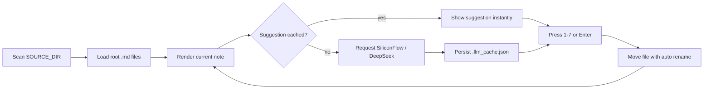

[](https://www.python.org/)
[](https://doc.qt.io/qtforpython/)
[](https://www.siliconflow.cn/)
[](./LICENSE)

# Markdown Note Triage

A keyboard-first desktop app for sorting Markdown notes into categories with optional DeepSeek-powered suggestions.

The app scans a notes folder, renders each Markdown file, lets you move it with `1-7`, send it to the recycle bin with `D`, and prefetches LLM suggestions for the full current batch so triage stays fast even for large backlogs.

中文说明见 [`README.zh-CN.md`](./README.zh-CN.md).

## Why this project

- Fast inbox-style triage for messy Markdown folders
- Keyboard-first workflow, no modal-heavy UI
- Optional LLM suggestions with cache and startup prefetch
- Safe file moving with automatic duplicate renaming
- Works without LLM configuration if you only want manual sorting

## Features

- Scan root-level `.md` files and ignore already sorted folders
- Sort by modified time so older notes are handled first
- Render Markdown in a PySide6 desktop UI
- Accept suggestions with `Enter`
- Skip current file with `S`
- Send the current file to the system recycle bin with `D`
- Retry the current suggestion with `R`
- Persist suggestion cache to `<SOURCE_DIR>/.llm_cache.json`
- Prevent dangerous `Pro/...` model usage

## Quick start

```bash
python -m venv .venv
. .venv/bin/activate
pip install -e .[dev]
cp .env.example .env
python -m src.app
```

On Windows PowerShell:

```powershell
python -m venv .venv
.venv\Scripts\Activate.ps1
pip install -e .[dev]
Copy-Item .env.example .env
python -m src.app
```

You can also run the console entrypoint after installation:

```bash
md-triage
```

## Configuration

Copy `.env.example` to `.env` and update the values:

| Variable | Required | Default | Description |
| --- | --- | --- | --- |
| `SILICONFLOW_API_KEY` | No | unset | Enables LLM suggestions when present |
| `SILICONFLOW_BASE_URL` | No | `https://api.siliconflow.cn/v1` | OpenAI-compatible API base URL |
| `LLM_MODEL` | No | `deepseek-ai/DeepSeek-V3` | Must not start with `Pro/` |
| `SOURCE_DIR` | No | `~/Notes` | Folder containing unsorted Markdown notes |
| `LLM_TIMEOUT_SEC` | No | `10` | Request timeout per attempt |
| `LLM_MAX_RETRY` | No | `1` | Automatic retry count |
| `LLM_CONTENT_LIMIT` | No | `4000` | Characters sent to the model |
| `PREFETCH_ENABLED` | No | `1` | Prefetch all suggestions for the current batch on startup |

## Keyboard shortcuts

| Key | Action |
| --- | --- |
| `1-7` | Move note into the matching category |
| `Enter` | Accept the current LLM suggestion |
| `S` | Skip current file |
| `D` | Send current file to the system recycle bin |
| `R` | Retry current suggestion |
| `Esc` | Exit with confirmation |

## Default categories

| Key | Folder | Meaning |
| --- | --- | --- |
| `1` | `01_physiological` | Daily essentials and life admin |
| `2` | `02_safety` | Work, money, and future planning |
| `3` | `03_leisure` | Entertainment and fun |
| `4` | `04_belonging` | Relationships and social life |
| `5` | `05_esteem` | Projects, hobbies, and achievement |
| `6` | `06_journal` | Diary and emotional notes |
| `7` | `07_reference` | Reference material, lookup notes, and encyclopedia-style summaries |

## How it works



## Development

Run tests:

```bash
pytest
```

Run lint:

```bash
ruff check .
```

Build a source distribution:

```bash
python -m build
```

## Roadmap

- [x] Keyboard-first triage UI
- [x] Suggestion caching and startup prefetch
- [ ] Configurable categories via external file
- [ ] First-run folder picker instead of env-only setup
- [ ] Multi-provider support beyond SiliconFlow
- [ ] Demo GIF and screenshots
- [ ] Packaged desktop releases on GitHub

## Security

- Never commit real API keys.
- `.env` is ignored by Git and should stay local.
- If a key is ever exposed, revoke and rotate it immediately.
- See [`SECURITY.md`](./SECURITY.md) for disclosure guidance.

## Contributing

Issues and pull requests are welcome. Start with [`CONTRIBUTING.md`](./CONTRIBUTING.md).

## License

Released under the [MIT License](./LICENSE).
